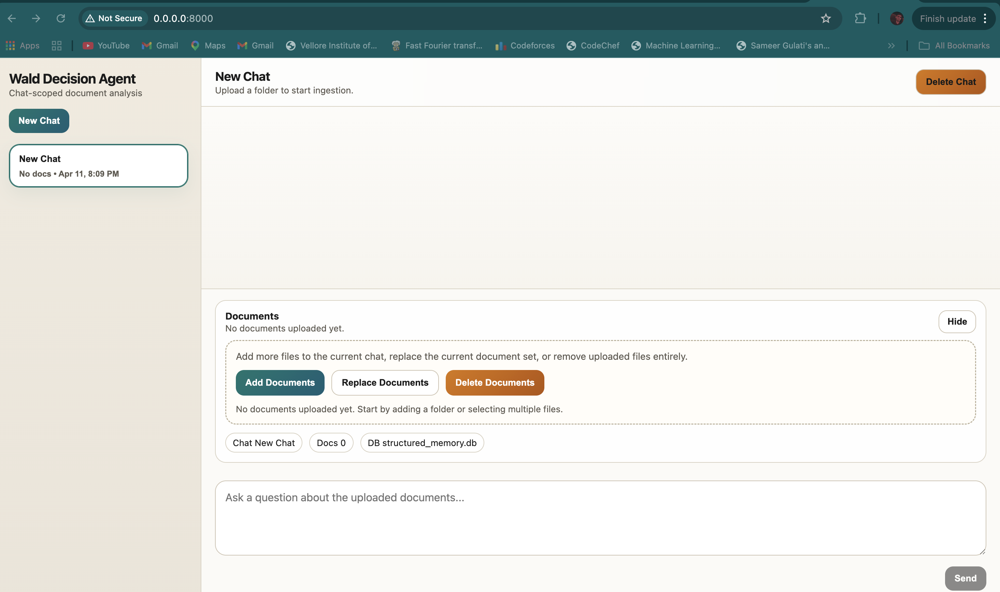
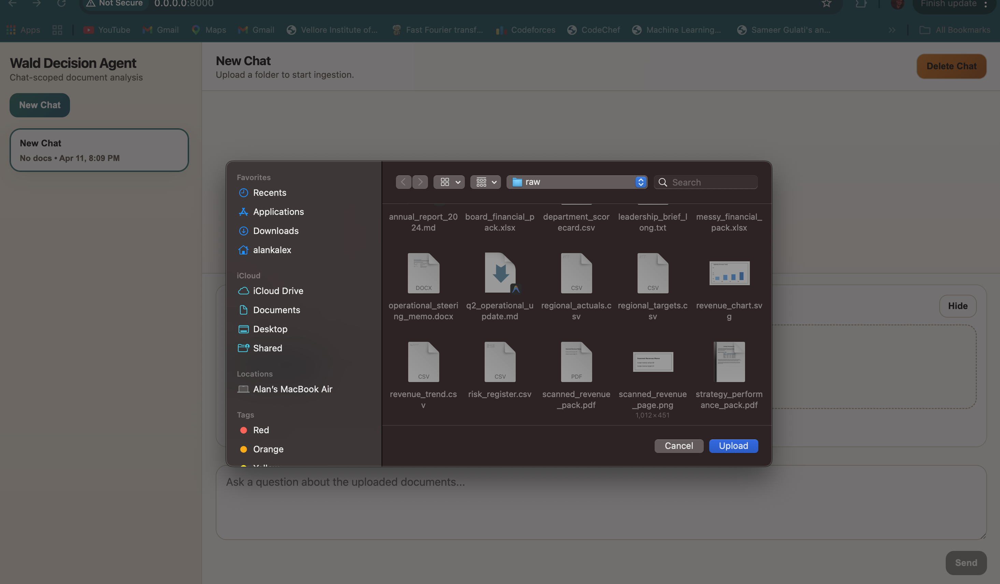
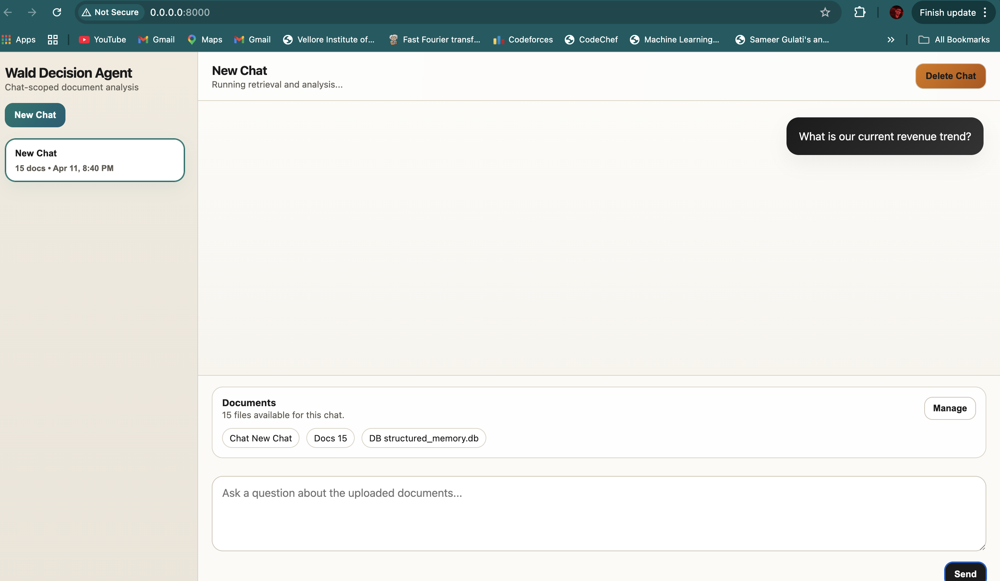
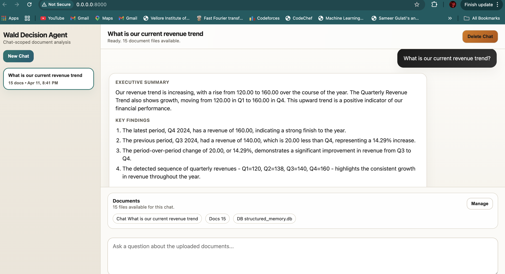
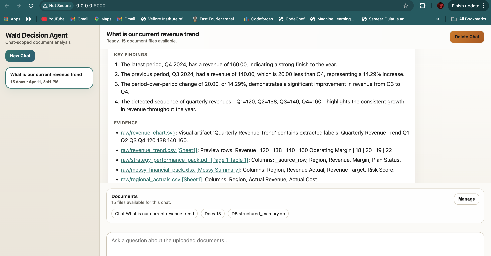
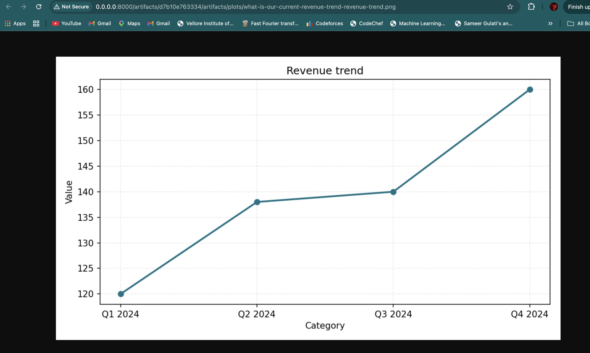
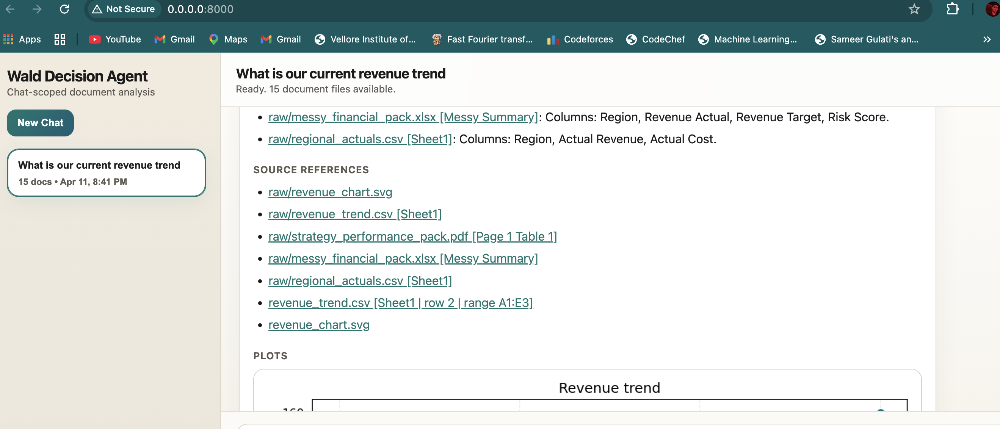
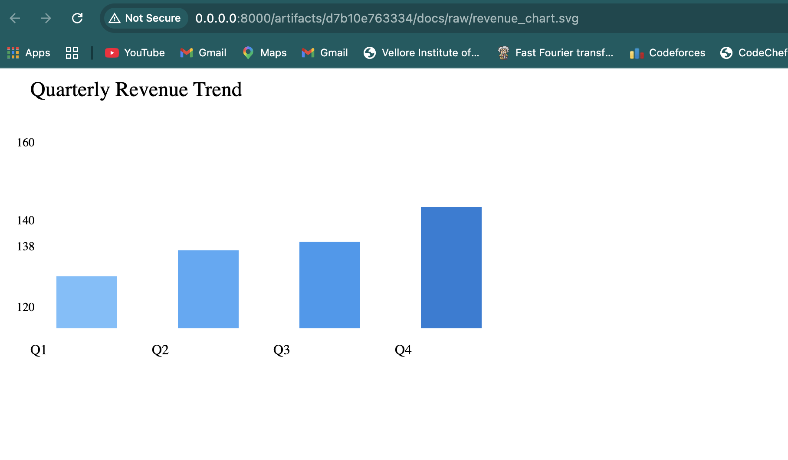

# Wald Decision Agent

Wald Decision Agent is a grounded document intelligence system for enterprise files. It ingests business documents, preserves structured tables, answers questions with source-backed evidence, performs deterministic calculations for numeric queries, and generates plots when the data supports them.

## Overview

The system is designed for mixed-document analysis across:

- `PDF` (Financial reports, strategy packs)
- `DOCX` (Meeting minutes, project briefs)
- `XLSX` / `XLS` (Budgets, targets, row-level data)
- `CSV` / `TSV` (Risk registers, simple tables)
- `TXT` / `MD` (Narrative notes, executive summaries)
- **Visual Evidence**: Integrated OCR and vision analysis for charts and scanned pages.

It combines:

- **Grounded Retrieval**: Narrative questions are answered with precise source citations.
- **Structured Reasoning**: Tables are processed into SQLite for complex joins and filters.
- **Deterministic Calculator**: Math and metrics are calculated using code, not LLM estimation.
- **Visual Reasoner**: Charts (SVG/PNG) are interpreted via Gemini Vision for data extraction.
- **ChromaDB Backbone**: Persistent, local vector storage for fast, reliable search.
- **Groq Acceleration**: High-speed answer synthesis using Llama-3-70B.

## Key Features

- **Chat-scoped Intelligence**: Each conversation maintains its own isolated context, files, and database.
- **Dynamic Ingestion**: Add or replace documents in real-time without losing conversation history.
- **Precision Metrics**: Surgical entity lookup for specific regions (APAC, EMEA) or departments (Finance, Engineering).
- **Proactive Visualization**: Generates bar charts and line graphs when the data supports visual comparison.

## Architectural Assumptions & Decisions

### 1. Why ChromaDB?
We chose **ChromaDB** as the vector backbone for its **local-first persistence** and **HNSW graph performance**. Unlike cloud-only vector stores, ChromaDB keeps data inside the workspace, ensuring total privacy for sensitive business documents while providing sub-millisecond retrieval.

### 2. Surgical Entity Lookup
To combat "Context Truncation" (where LLMs miss specific rows in large tables), we implemented a dedicated **Entity Lookup Engine**. It detects mentions of specific regions or departments and performs a direct row-level scan of structured data, ensuring 100% precision for entity-specific queries.

### 3. Abstention over Hallucination
The agent is explicitly programmed to **abstain** rather than guess. If a metric cannot be found in the structured tables OR retrieved from the text, the agent will report the gap in the data rather than providing a generic summary.

### 4. Hybrid Reasoning
The system uses a **Planner** to decide the best tools for each query:
- **CalculationEngine**: For numeric lookups, rankings, and math.
- **VisualReasoner**: For interpreting image-based charts.
- **VectorRetriever**: For semantic and narrative context.


## Requirements

- Python `3.9+`
- `pip`
- API keys in `.env`:
  - `GROQ_API_KEY`: Primary for high-speed answer formatting. *(Create one at [https://console.groq.com/keys](https://console.groq.com/keys))*
  - `GEMINI_API_KEY`: Used for OCR, vision extraction, and embeddings. *(Create one at [https://aistudio.google.com/api-keys](https://aistudio.google.com/api-keys))*

## Setup

### macOS / Linux
```bash
python3 -m venv .venv
source .venv/bin/activate
pip install -r requirements.txt
cp .env.example .env
```

### Windows
```bash
python -m venv .venv
.venv\Scripts\activate
pip install -r requirements.txt
copy .env.example .env
```

## How to Run

### Start the Web App
```bash
PYTHONPATH=src python -m wald_decision_agent.main serve --host 0.0.0.0 --port 8000
```
Then open [http://localhost:8000](http://localhost:8000).

### CLI Mode (Single Question)
```bash
PYTHONPATH=src python -m wald_decision_agent.main ask --docs data/raw --question "In the strategy_performance_pack.pdf, what is the revenue reported for APAC?"
```

## Demo & Screenshots

### 🎥 Video Walkthrough

<video src="assets/wald%20demo.mov" controls="controls" width="100%"></video>

---

### 📸 Product Gallery

#### 1. Dynamic Document Ingestion
Upload mixed file types (PDFs, Excel data) dynamically into an isolated chat context.
<p align="center">
  
  &nbsp; &nbsp;
  
</p>

#### 2. Hybrid Reasoning Queries
Ask complex questions that require both structured SQL execution and narrative context extraction.
<p align="center">
  
</p>

#### 3. Leadership-Ready Answers & Visualizations
The agent formats factual, high-quality summaries and dynamically generates relevant plots.
<p align="center">
  
  &nbsp; &nbsp;
  
</p>

<p align="center">
  
</p>

#### 4. Strict Grounded Citations
Every fact and metric is grounded with exact document and row-level citations to prevent hallucination.
<p align="center">
  
  &nbsp; &nbsp;
  
</p>
